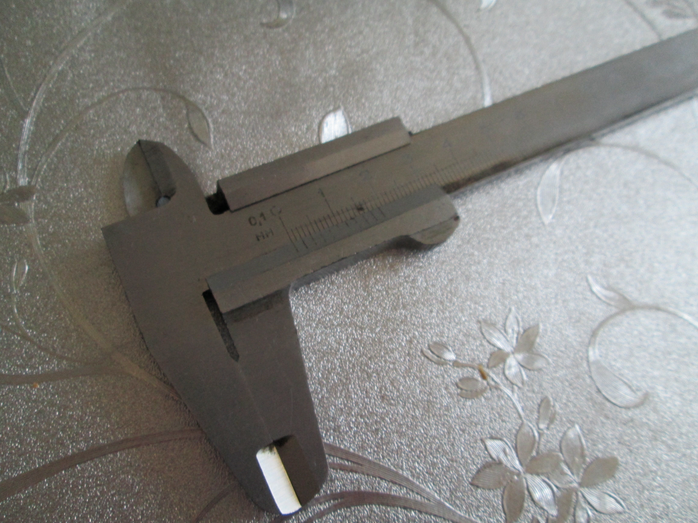
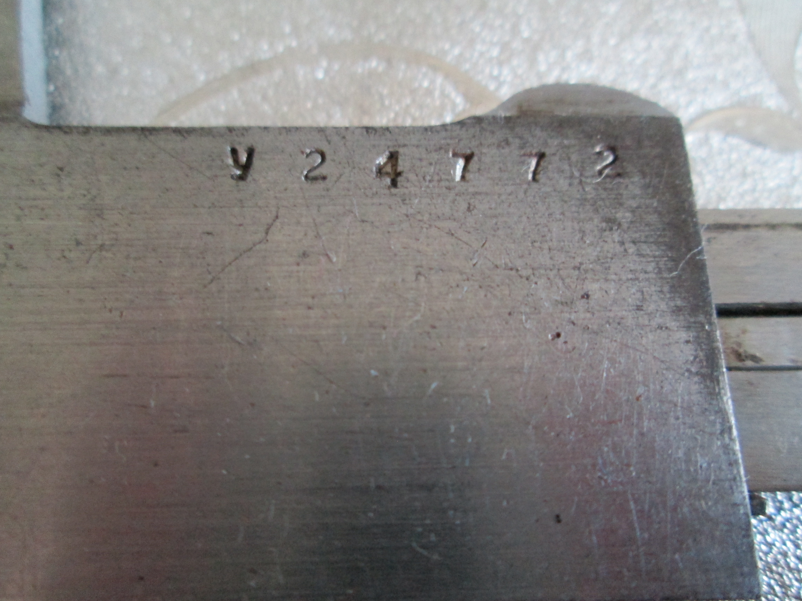
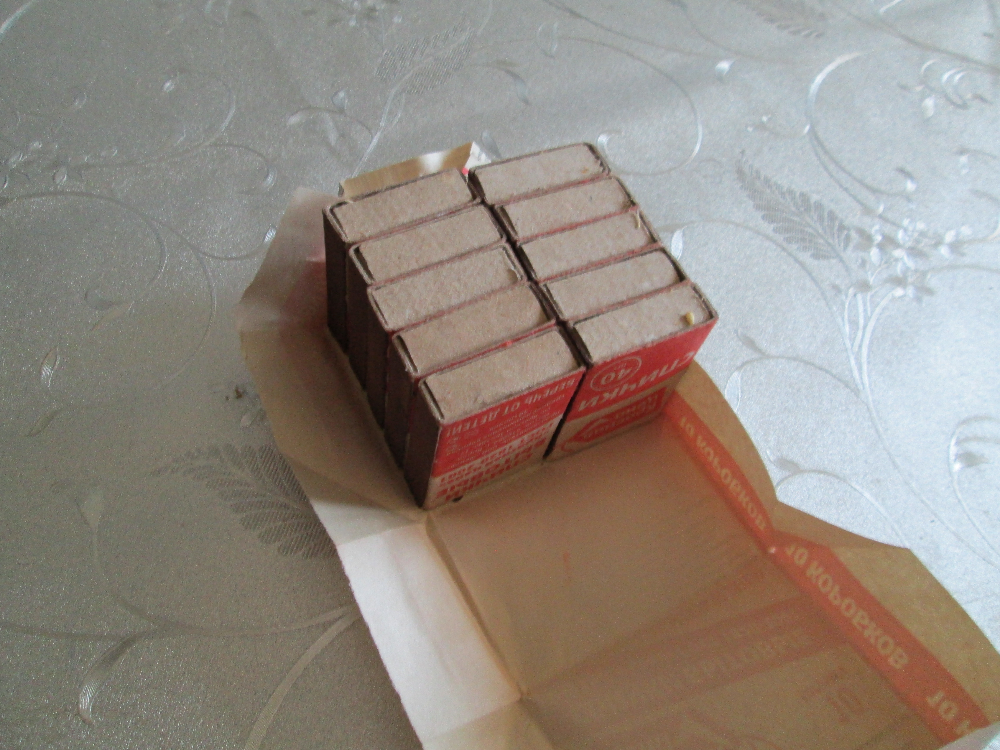

# Задание 1

Вот инструмент, который был использован в решении:

Штангенциркуль ШЦ-I, серийный номер У24722, наименьшее деление равно 0.1 см.

Вот субъект измерений:

Упаковка спичечных коробков торговой марки "Красная цена", содержащая 10 коробков.

Измерив эту упаковку, я получил следующий результат:

| Ширина | Высота | Глубина |    Объём   |
|--------|--------|---------|------------|
| 5.7 см | 3.4 см | 4.5 см  | 87.21 см^3 |

Открыв её, мы видим 10 коробков:

Я пронумеровал их:

Результаты измерения:

| Номер  | Ширина | Высота | Глубина |    Объём    |
|--------|--------|--------|---------|-------------|
|    1   | 3.8 см | 1.3 см | 4.9 см  | 24.206 см^3 |
|    2   | 3.8 см | 1.4 см | 4.9 см  | 26.068 см^3 |
|    3   | 3.8 см | 1.3 см | 5 см    | 24.7 см^3   |
|    4   | 3.8 см | 1.3 см | 5 см    | 24.7 см^3   |
|    5   | 3.8 см | 1.3 см | 4.9 см  | 24.206 см^3 |
|    6   | 3.8 см | 1.3 см | 5 см    | 24.7 см^3   |
|    7   | 3.8 см | 1.3 см | 5 см    | 24.7 см^3   |
|    8   | 3.8 см | 1.3 см | 5 см    | 24.7 см^3   |
|    9   | 3.8 см | 1.3 см | 5 см    | 24.7 см^3   |
|   10   | 3.8 см | 1.3 см | 5 см    | 24.7 см^3   |
